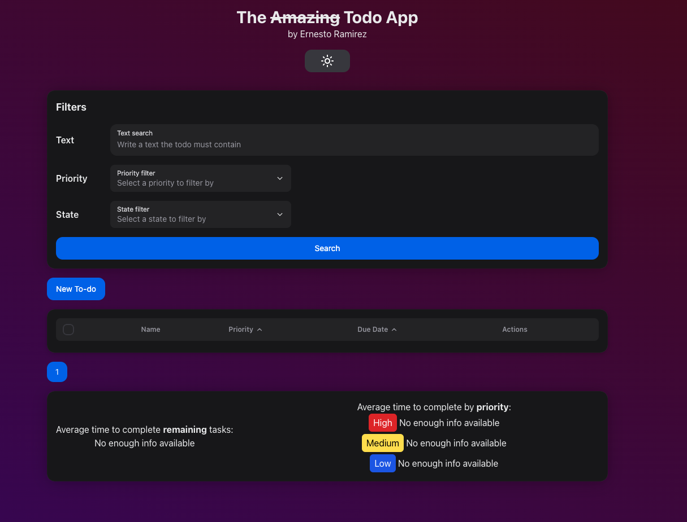

# Todo App (Front)

Client implementation of a simple yet useful application
for organizing incoming activities. Depending on [Todo-App project](https://github.com/ernestorbemx/TodoApp). This repo includes Singe Page Application using Vite built on top of React Components and TypeScript.



## Table of Contents

- [Structure](#structure)
- [Features](#features)
- [Prerequisites](#prerequisites)
- [Installation](#installation)
- [Running locally](#running-locally)
- [Production build](#building-for-production)
- [Testing](#testing)
- [Contributing](#contributing)

## Structure

React components are located in `src/components` folder along with it corresponding tests. There's also a folder `src/views` for application views. Since no routing is needed for this app, is just a TodoView.tsx.

HTTP related stuff like axios instance is located in `src/http`.

Globally used types are defined in `src/types.ts`

Other locations are Vite standard locations.

## Features

- Create Todo (Text, Priority, Due Date)
- Update Todo (Text, Priority, Due Date)
- Update Todo Status (Done/Undone)
- Delete Todo
- Get Todos (Paginated, Sorted and Filtered)
- Show real time completion stats
- Dark Mode

## Prerequisites

There's no need for an specialized IDE for this project.
However, since the development was done using Visual Studio Code, using it
is super recommendable.

The needed software to run this project is:

- Node 18
- NPM 10

## Installation

Please be sure that you have the software requirements as [Prerequisites](#prerequisites) says.

Instructions to set up project dependencies:

1. Clone Repo

```bash
git clone https://github.com/ernestorbemx/TodoApp-Front.git
```

2. Change directory to the cloned project folder

```bash
cd TodoApp-Front
```

3. Install dependencies

```bash
npm i
```

## Running Locally

Please be sure that you have the software requirements as [Prerequisites](#prerequisites) says and follow [installation instructions](#installation)

Instructions to get your project up and running locally (UNIX-like systems):

1. Run development script

```bash
npm run dev
```

## Building for production

Please be sure that you have the software requirements as [Prerequisites](#prerequisites) says and follow [installation instructions](#installation)

Instructions to get your project up and running locally (UNIX-like systems):

1. Run build script

```bash
npm run buiild
```

2. Run production build

```bash
npm run preview
```

## Testing

After following [this instructions](#installation), you can run the script:

```bash
npm run test
```

## Contributing

Contributions are welcome! For requesting changes, first open an issue.

When developing changes, please:

1. Fork the repo
2. Create your feature branch (git checkout -b feature/FeatureName)
3. Commit your changes (git commit -m 'Add some feature')
4. Push to the branch (git push origin feature/FeatureName)
5. Open a Pull Request
