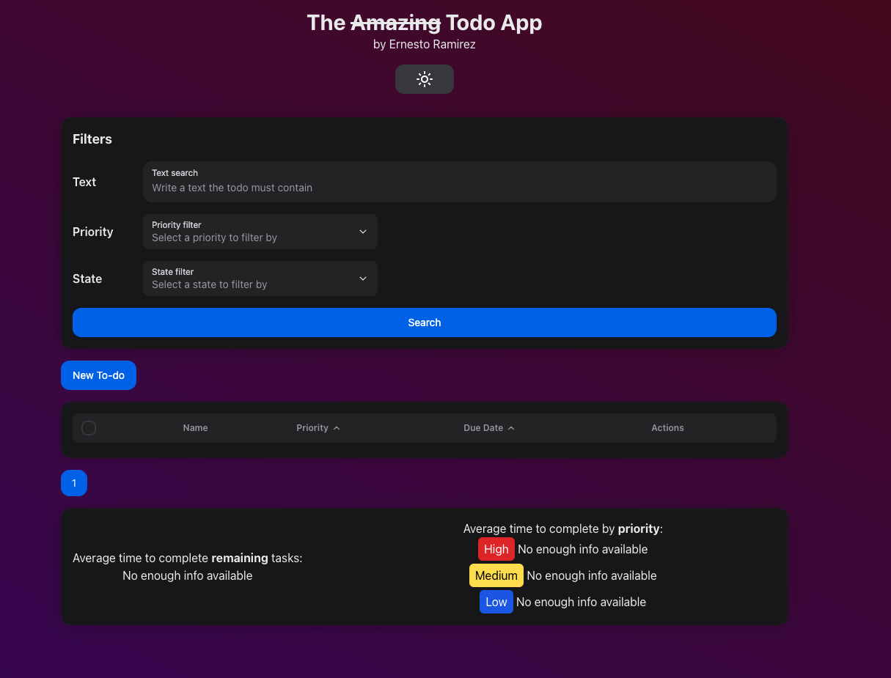

# Todo App (Front)

This project is a client-side implementation of a Todo application. It allows users to manage their tasks efficiently with features like prioritization, due dates, and real-time stats. To get started:

1. Ensure you have the prerequisites installed.
2. Follow the [Installation](#installation) and [Running Locally](#running-locally) sections to set up the project.
3. Explore the features and customize the app as needed.

It depends on [Todo-App project](https://github.com/ernestorbemx/TodoApp). This repo includes a Single Page Application using Vite built on top of React Components and TypeScript.



## Table of Contents

- [Structure](#structure)
- [Features](#features)
- [Prerequisites](#prerequisites)
- [Installation](#installation)
- [Running Locally](#running-locally)
- [Building for Production](#building-for-production)
- [Testing](#testing)
- [Contributing](#contributing)
- [License](#license)

## Structure

React components are located in the `src/components` folder along with their corresponding tests. There's also a folder `src/views` for application views. Since no routing is needed for this app, it is just a `TodoView.tsx`.

HTTP-related utilities like the Axios instance are located in `src/http`.

Globally used types are defined in `src/types.ts`.

Other locations follow Vite's standard structure.

## Features

- Create Todo (Text, Priority, Due Date)
- Update Todo (Text, Priority, Due Date)
- Update Todo Status (Done/Undone)
- Delete Todo
- Get Todos (Paginated, Sorted, and Filtered)
- Show real-time completion stats
- Dark Mode

## Prerequisites

There's no need for a specialized IDE for this project.
However, since the development was done using Visual Studio Code, using it
is highly recommended.

The required software to run this project is:

- Node 18
- NPM 10

## Installation

Please ensure that you have the software requirements as mentioned in [Prerequisites](#prerequisites).

Instructions to set up project dependencies:

1. Clone the repository:

```bash
git clone https://github.com/ernestorbemx/TodoApp-Front.git
```

2. Change directory to the cloned project folder:

```bash
cd TodoApp-Front
```

3. Install dependencies:

```bash
npm i
```

## Running Locally

Please ensure that you have the software requirements as mentioned in [Prerequisites](#prerequisites) and follow the [installation instructions](#installation).

Instructions to get your project up and running locally (UNIX-like systems):

1. Run the development script:

```bash
npm run dev
```

2. Open your browser and navigate to the provided local development URL.

## Building for Production

Please ensure that you have the software requirements as mentioned in [Prerequisites](#prerequisites) and follow the [installation instructions](#installation).

Instructions to build and preview the production version:

1. Run the build script:

```bash
npm run build
```

2. Preview the production build:

```bash
npm run preview
```

## Testing

After following the [installation instructions](#installation), you can run the test script:

```bash
npm run test
```

## Contributing

Contributions are welcome! To request changes, first open an issue.

When developing changes, please:

1. Fork the repository.
2. Create your feature branch:

```bash
git checkout -b feature/FeatureName
```

3. Commit your changes:

```bash
git commit -m 'Add some feature'
```

4. Push to the branch:

```bash
git push origin feature/FeatureName
```

5. Open a Pull Request.

## License

This project is licensed under the MIT License. See the [LICENSE](./LICENSE) file for details.
